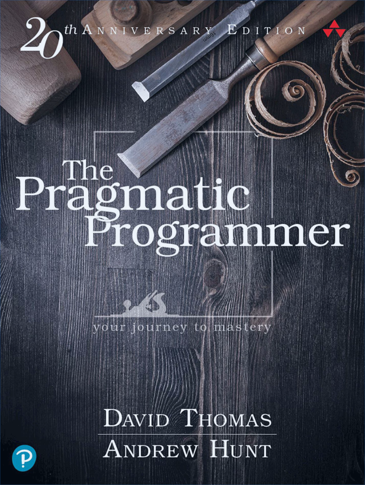

## Topics
- Coding mindset
- Good-Enough Software
- Requirements and documentation
- Elements of good design
- Trace bullet and prototyping
- Debugging, refactoring, testing
- Working together, communication
- The moral compas


---

# Pragmatic programmer traits

- **Care about your craft**
- **Think about your work**
- Early/fast adopters
- Ask questions
- Critical thinkers
- Realistic
- Jack of all trades


---

# Philosphy

- Remember the big picture
- Take responsibility
- Don't live with broken windows
- Continiously make many small improvements (code, your skills)


---

# Coding mindset

> Coding is not mechanical.
> There are decisions to be made every minute.
> These decisions require careful thought and judgement.

- Listen to your instincts
- Prototype if stuck
- When reading others code, look for strange things
- Don't live with broken windows

*Challenge: Find a broken window in one of your projects*

---

# Don't program by coincidence


- Understand **why** code works - can you explain it?
- Understand technology and tools you use
- Don't assume, prove it with tests, asserts
- Document assumptions
- Close enough is not enough
- If you can't tell if something is reliable, assume the worst
- Work from a plan, prioritize your effort


---

# Good-Enough software

> Don't worry: it could never be perfect.

- Involve your users in the trade-off
- Make quality a requirements issue
- Consider software life-time

---

# Requirements

> Programmers help people understand what they want

- No one knows exactly what they want
- Requirements are learned in a feedback loop
- The whole project is a requirement gathering exercise
- Distinguish between a hard requirement and invitation to explore
- Work with a user to think like a user
- Requirement documents are for planning

---

# Documentation

> Documentation is an integral part of the development process

- Embed documentation in code - easier to update
- Don't repeate yourself
- Focus on documenting what is not obvious from code (whys, trade-offs)


---

# The essence of good design

- Good design is easier to change than bad design
- If not sure, make it replacable
- Reversability - there are no final decisions
- Develop your instincts

---

# DRY - Don't Reapeat Yourself

- Duplication in code, documentation, data schema, config
- Implicit knowledge duplication/dependency

*Challenge: Find example of duplication in our code.*

---

# Orthogonality - decoupling

> **Eliminate effects between unrealted things**

- Write shy code
- Avoid global data
- Avoid duplication
- Make code easy to test

---

# Design with contracts

- Define and check function inputs and outputs
- Use assertions to prevent the impossible
- Crash early

---

# Inheritance tax - too much coupling


```python
class Vehicle:
    def __init__():
        self.speed = 0

    def move(speed):
        self.speed = speed

class Car(Vehicle):
    def info():
        print(f"Car moving at {self.speed}")

my_ride = Car()
car.move(30)
```


---

# Inheritance alternatives

- Composition - for delegating functionality
- Mixins - for sharing functionality
- Interfaces - for polymorphism

*Challenge: Find good or bad example of inheritance or alternatives in one of your projects. Explain why.*

---

# Configuration

- Parameterize you app using external configuration
- Don't make your configuration global
- Decouple your code from the details of the configuration representation
- Validate, test your configuration (pydantic + end-to-end test)


---

# Configuration-as-a-service

- Share configuration between multiple applications
- Synchronized, global changes to configuration
- Authentication and acccess control
- Configuration UI
- Dynamic configuration

---

# Naming

> The beginning of wisdom is to call things by their proper name.
>
> -- *Confucius*

- Look for names that clarify what you mean?
- For variables: why do I create it?
- For functions: why it does what it does?
- Follow traditions and project vocabulary
- Rename when needed

---

# Tracer bullet development

- End-to-end connection among the components
- Prioritize important requirements, where you have doubts and see risks
- Production quality code with checks, tests and docs


---

# Prototyping

- Focus on a few aspects, ignore details
- Prototype what carries risk, hasn't been tried before: architecture, performance, algorithms, models, tools
- **Disposable code**


---

# Debugging

- Add test before fixing code
- Read the error message
- Explain the error to someone
- Binary search


---

# Refactoring

> Refactoring - restructuring an existing body of code, altering its internal structure without changing its external behaviour.

- Helps to keep the code easy to change
- Refactor early and often in small steps
- Requires automated testing
- It is not the time to add features
- It is not rewrite of the whole codebase
- Don't let existing code dictate future code - refactor!


---

# When to refactor

- Duplication
- Nonorthogonal design
- Outdated knowledge
- Usage
- Performance
- Tests pass

---

# Testing

- The main benefit comes from the process of writing tests, not finding bugs
- Test is the first user of your code, provide feedback and drives your coding
- Design to test
- Property-based testing (Hypothesis)

---

# Working together

> **Conways's Law**:
> Organizations which design systems are constrained to produce designs
> which are copies of the communcation structures of the organizations.

- Team trust - psycholigical comfort
- Don't go into code alone (pair programming, reviews)

---

# Pragmatic teams

- Maintain small (max 10-12 people), stable teams
- Quality is a team issue - no broken windows
- Schedule improvement and innovation: maintainace, retrospective, tech experiments, learning
- Communicate to eliminate duplicated work
- Debate internally, speak with one voice externally

---

# The moral compas

- Do no harm
- Don't enable scumbags
- It's your life, have fun!


